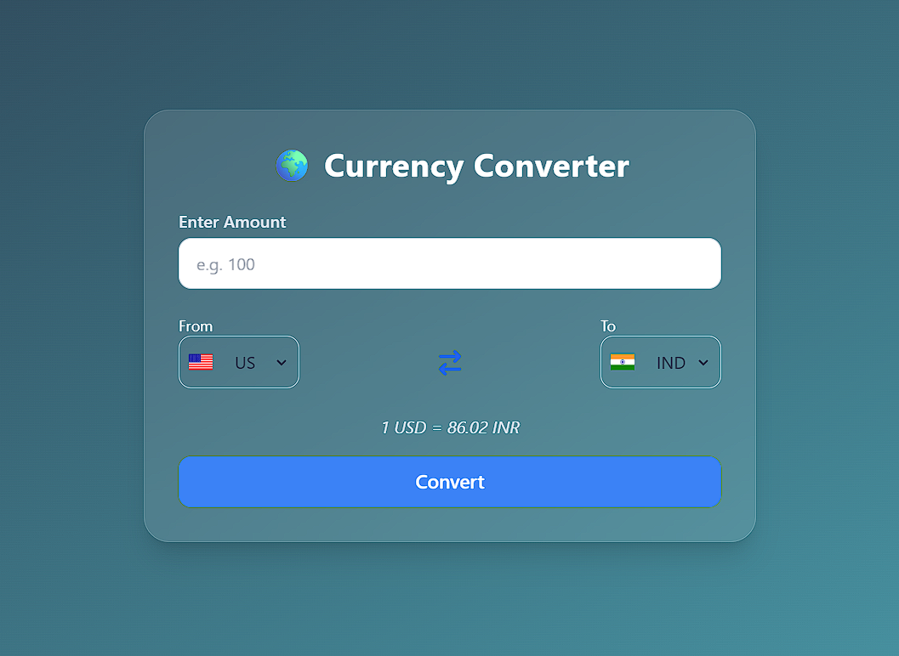

# 💱 Currency Converter

A sleek, responsive **React** app to convert between major global currencies in real time. Built with **Tailwind CSS**, featuring a clean **glassmorphism UI**, flag-based selectors, and modern UX.



---

## ✨ Features

- 🔁 Real-time conversion between 10 popular currencies
- 🧊 Beautiful glassmorphism card layout
- 🌍 Flag-based country dropdowns
- 🎯 Swap functionality between "From" and "To"
- 📱 Fully responsive design
- ⚠️ Handles loading and error states
- 💡 Clean component-based structure using React

---

## 🛠️ Tech Stack

- ⚛️ React (Vite)
- 💨 Tailwind CSS
- 🌐 Exchange Rate API ([exchangerate-api.com](https://www.exchangerate-api.com/))
- 🎯 React Hooks (useState, useEffect)

---

## 🚀 Live Demo

🔗 [View Live on GitHub Pages](https://harsh000777.github.io/currency_converter/)


---

## 🔧 Installation

```bash
git clone https://github.com/harsh000777/currency_converter.git
cd currency-converter
npm install
npm run dev
```
